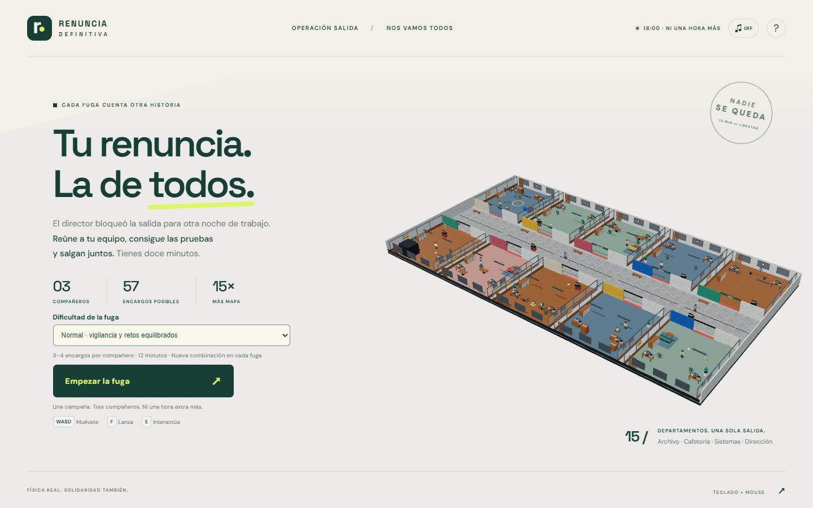
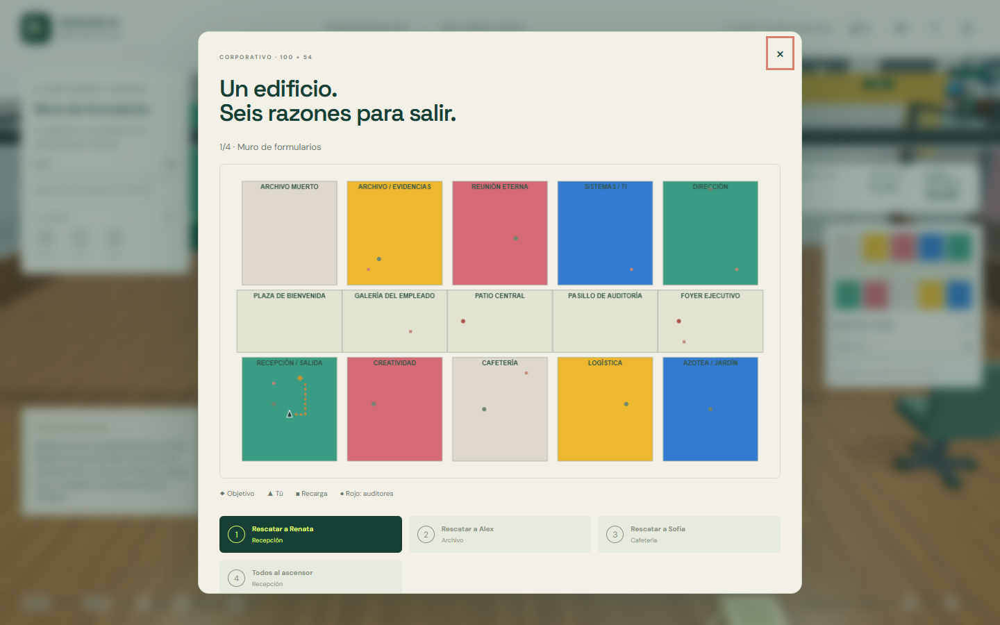
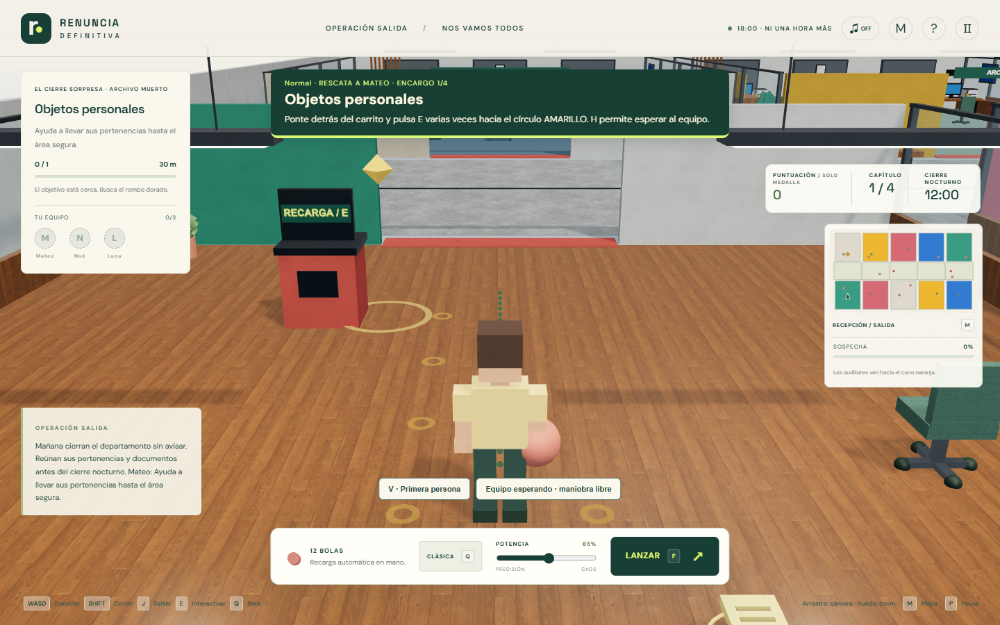

# Renuncia definitiva · Nos vamos todos

**Tu renuncia. La de todos.**

A las 18:00, el director bloquea la salida para imponer otra noche de horas extra. Rescata a tres compañeros y salgan por el ascensor. Cada fuga elige nombres, departamentos y 3–4 encargos por compañero: reunir pruebas, arreglar equipos, desviar llamadas o recuperar pertenencias. El límite continúa siendo doce minutos.

Una campaña Web 3D con primera/tercera persona, física, compañeros, auditores y 57 encargos posibles. **La puntuación determina una medalla; no impide completar la historia.**

Estado: **versión local jugable y probada; publicación en GitHub Pages pendiente**. El proyecto y todo su historial Git se trasladaron a la carpeta `Examen Tema 1` indicada por el alumno. La vista previa local sirve esta misma carpeta.



## Jugar

Desde la raíz del proyecto:

```sh
node tools/serve.cjs
```

Abre **http://127.0.0.1:4173/**. No necesitas instalar paquetes para ejecutar el juego. Alternativamente: `python -m http.server 4173 --bind 127.0.0.1`.

Se necesita teclado y mouse, un navegador con WebGL 2/WebAssembly y conexión a Internet para Three.js, Rapier y las fuentes. La interfaz se adapta a ventanas estrechas; esta versión no incluye controles táctiles. No abras `index.html` con `file://`.

## Historia y misión

Se sortean cinco contextos narrativos con apertura y desenlace propios: horas extra, cierre de departamento, nómina borrada, capacitación obligatoria y guardia nocturna.

El banco contiene **57 situaciones escritas, sobre siete familias de mecánicas**: derribo, recogida, secuencia ordenada, mantener una acción en un terminal, entrega física, sigilo y tiro desde una marca. No son 57 minijuegos con controles distintos. Sus historias, parámetros y destinos se combinan para producir una fuga diferente, sin repetir una familia dentro de un mismo rescate.

Cada fuga tiene 9–12 mini misiones en total, tres rescates y una salida. [Consulta el catálogo completo](docs/ENCARGOS.md). Los encargos y nombres se seleccionan localmente; no requieren una API ni generación de texto en Internet.

| Dificultad | Archivadores | Terminal | Radio de entrega | Marca de tiro | Visión / velocidad del auditor | Sospecha por segundo |
| --- | --- | --- | --- | --- | --- | --- |
| Tranquila | 2 | 2 s | 2.3 | 5 unidades del blanco | 5.5 / 1.5 | +7; oculta −6 |
| Normal | 3 | 3 s | 1.8 | 7 unidades del blanco | 7.5 / 2.1 | +13; oculta −3.5 |
| Auditoría extrema | 4 | 4 s | 1.3 | 9 unidades del blanco | 10 / 2.8 | +20; oculta −2 |

La recogida requiere dos objetos, o tres en extrema. Las secuencias exigen el orden mostrado; el sigilo obliga a repetir sus controles al ser descubierto. La dificultad se elige **antes** de empezar y se conserva al reintentar.

El HUD muestra **el paso actual en una franja superior opaca**, con la tecla y la acción, su contador, la distancia y los compañeros reclutados. Un rombo dorado marca el destino, pequeñas marcas en el suelo indican una ruta y el minimapa permite orientarse. El mapa ampliado muestra la campaña completa.

**Victoria:** completa los encargos, reúne a los tres compañeros y pulsa E frente a la cabina del ascensor. La pantalla final se abre en esa misma interacción. No espera a que se detengan los cuerpos físicos y no exige una puntuación mínima ni munición restante.

**Derrota:** se agotan los doce minutos, la sospecha llega al 100% o el personaje cae fuera del área segura. Se puede reintentar desde el último encargo conservando la combinación aleatoria, la dificultad, el equipo y los encargos anteriores. El reintento concede al menos tres minutos; no conserva la posición física exacta de cada objeto.

**Nueva campaña:** restablece actores, misiones, recursos, puntuación, tiempo y objetos. Se sortean otra combinación, nombres y departamentos. La potencia elegida se conserva. Pausar, abrir un diálogo, abrir el mapa o cambiar de ventana detiene la simulación y el reloj.

## Un mapa quince veces mayor

El suelo anterior medía 20 × 18 = 360 unidades². El nuevo suelo mide **100 × 54 = 5,400 unidades²: exactamente 15 veces el área**. Las dimensiones del personaje se mantienen: se amplió el espacio, no se escaló al jugador junto con el escenario.

Hay diez departamentos y cinco áreas del pasillo central: recepción, archivo muerto, archivo de evidencias, creatividad, sala de reuniones, cafetería, sistemas, logística, dirección, jardín y las cinco áreas públicas que los conectan. Las habitaciones tienen puertas reales y colliders alineados con su geometría. Las quince áreas están conectadas en la navegación.



## Personajes, auditores y bolas

Los tres compañeros tienen nombres aleatorios y esperan en los departamentos elegidos para esa fuga. Al rescatarlos te siguen a 4.5–6.7 unidades, respetan paredes y no tienen colisión sólida con el jugador, las bolas ni los carritos. **H** les ordena esperar o seguir. Durante una entrega esperan automáticamente para dejar espacio. Hay otros empleados, un director y dos auditores; diez personajes además del jugador.

Los auditores detectan dentro de un cono de 5.5, 7.5 o 10 unidades según dificultad, con visión cercana adicional. Una consulta física comprueba si una pared interrumpe su línea de visión. Estar a la vista aumenta la sospecha; ocultarse permite reducirla. Una bola lanzada genera una distracción cercana durante unos segundos. El cono naranja dibujado apunta en la misma dirección que la detección.

| Bola | Desbloqueo | Comportamiento |
| --- | --- | --- |
| Clásica | Desde el inicio | Masa 3.2, restitución 0.38; equilibrada |
| Pesada | Primer rescate | Masa 6.2, restitución 0.15 y velocidad menor; mueve carritos y pilas |
| Rebote | Segundo rescate | Masa 2.8, restitución 0.88 y velocidad mayor; aprovecha paredes |

Empiezas con 12 bolas. La siguiente aparece en la mano tras un breve intervalo; ya no debes volver a una sola máquina después de cada tiro. **Siete máquinas rosas recargan hasta 16 bolas**. Cada encargo garantiza al menos ocho bolas al comenzar; los bonos reponen recursos. Si necesitas disparar y te quedas sin bolas, la ruta te guía a recargar; no desvía de la salida al terminar la historia.

## Controles

| Control | Acción |
| --- | --- |
| WASD o flechas | Caminar respecto a la cámara |
| Shift | Correr |
| J | Saltar y subir a obstáculos bajos; Espacio conserva el lanzamiento |
| Arrastrar el mouse | Girar cámara y apuntar |
| Rueda | Ajustar distancia de cámara |
| F, espacio o LANZAR | Lanzar la bola |
| E | Hablar, recoger, empujar, recargar, activar estaciones o salir; mantener en terminales |
| Q | Cambiar el tipo de bola desbloqueado |
| M | Abrir/cerrar el mapa y consultar rescates |
| V / botón de cámara | Primera o tercera persona |
| H / botón de equipo | Esperar aquí o seguir al jugador |
| P o Escape | Pausar/continuar o cerrar el diálogo/mapa |
| Deslizador POTENCIA | Modificar la velocidad real de lanzamiento |
| ♫ | Activar/desactivar sonidos sintetizados originales |

## Puntuación opcional

- Objetivo derribado: **+100**.
- Cada derribo adicional en una cadena de menos de 1.8 s entre caídas: **+25**.
- Derribo tras un rebote de la bola del tiro actual en una pared: **+50**, una vez por tiro.
- Encargo completado: **+200**.
- Bono: **+100 y dos bolas**.
- Planta o cafetera derribada: **−150**, una sola vez por objeto; aumenta ligeramente la sospecha.

La medalla final es oro desde 4,200, plata desde 3,000 y bronce por debajo. **Incluso una puntuación negativa permite ganar si se cumple la misión.** El indicador ×N representa la longitud de la cadena, no multiplica toda la puntuación.

## Oficinas, materiales y rendimiento

La versión 0.13 conserva el escenario y las mecánicas, con una nueva dirección visual: madera cálida, concreto suave, alfombra por departamento, pintura mate con acentos azul/verde/amarillo/coral, mamparas de vidrio, metal satinado, sofás de tejido, mesas con bordes suaves, plantas y luminarias lineales. No reproduce una oficina real ni utiliza logotipos de Google.

Se incluyen **12 mapas PBR locales** (color, normal y rugosidad), reutilizados por todos los materiales. Madera y concreto usan 1024²; pintura y tejido, 512². Se distribuyen como WebP y ocupan aproximadamente 1.16 MB en conjunto. Solo los mapas de color usan sRGB. Los UVs se proyectan en metros antes de agrupar geometría, con RepeatWrapping, mipmaps y anisotropía limitada a 8: una pared larga no estira la imagen de un cubo.

Los materiales distinguen metal, vidrio transparente, superficies mates y pantallas emisivas. Un entorno de reflexión precalculado con RoomEnvironment, luz hemisférica, una luz direccional con sombras suaves y dos luminarias cercanas aportan profundidad sin renderizar múltiples mapas de sombra. Las luminarias restantes son geometría emisiva. El vidrio usa una sola pasada; las mallas estáticas se agrupan por material/sector, las piezas de cada mueble por material y las piezas rígidas del personaje dentro de sus nodos animados. Los cuatro clips y los nodos de AnimationMixer se conservan.

Las colisiones siguen siendo Rapier: colliders simples para muebles, cilindros para macetas y envolventes continuas para las mamparas, evitando costuras entre sus postes. Hay un collider que se retira al abrir las puertas del ascensor. El paso sigue siendo fijo a 1/60 s; las bolas usan CCD y se ajustó la predicción de contactos para evitar hundimientos breves al caer. El controlador permite escalones de 18 cm, salto con J y aterrizaje sobre muebles sin atravesarlos. Los compañeros conservan su comportamiento sin bloquear al jugador.

[Detalle de materiales, física y comprobaciones](docs/RENOVACION-VISUAL.md). Las mediciones son de este equipo y no garantizan la misma tasa de FPS en otros dispositivos.

## R2 y R4: evidencia explícita

**R2 se cumple:** `scene.js` crea un `GLTFLoader` y carga `assets/models/campus.glb` y `assets/models/employee.glb`. El escenario renderizado procede del GLB. Sus mallas estáticas se agrupan por material después de cargarlas para reducir llamadas de dibujo; se conservan los datos del escenario y se aplican los mapas PBR locales.

**R4 se cumple:** `employee.glb` contiene cuatro animaciones glTF reales: `Idle`, `Walk`, `Run` y `Throw`. `character.js` crea `THREE.AnimationMixer`, convierte los clips cargados en acciones con `clipAction`, mezcla sus transiciones y reproduce el estado según reposo, caminar, correr o lanzar/empujar. Son animaciones de nodos articulados incluidas en el archivo.

Consulta [la comprobación detallada de R2 y R4](docs/R2-R4.md), que incluye los lugares del código y cómo observar cada estado.

## Física y arquitectura

Three.js 0.180.0 se importa por CDN e import map; Rapier 3D Compat 0.17.3 controla gravedad −9.81, colisiones, cuerpos rígidos y un paso fijo de 1/60 s. El personaje tiene cápsula cinemática y Character Controller; sillas, archivadores, servidores, carritos, plantas, cafetera y bolas responden a la física. Los proyectiles usan detección continua de colisiones.

La potencia 25–100 cambia la velocidad base `8 + potencia × 0.17`; cada tipo de bola aplica su multiplicador. La guía punteada indica dirección y primer obstáculo, no todos los rebotes futuros.

Las bolas se crean únicamente si su volumen de salida está libre. Los bonos usan posiciones candidatas comprobadas. Los encargos comprueban el volumen completo antes de crear pilas y carritos. Si está ocupado prueban posiciones cercanas; si no hay ninguna, piden despejar el centro y reintentan sin superponer cuerpos. Las ubicaciones se ensayan en las tres dificultades. Los bonos flotan intencionalmente como señal visual de objeto recogible. Una entrega se completa al permanecer el carrito 0.4 segundos dentro del círculo, cuyo radio depende de la dificultad.

```text
index.html                    Pantallas, diálogos, HUD e import map
assets/css/                   Identidad visual y HUD de campaña
assets/js/main.js             Carga y recuperación ante errores
assets/js/scene.js            GLTFLoader, escenario, luces y cámara inicial
assets/js/office-materials.js Materiales PBR compartidos y UVs métricas
assets/js/physics.js          Rapier, colliders y validación de espacios
assets/js/character.js        Movimiento físico y AnimationMixer del jugador
assets/js/input.js            Teclado, mouse, foco y pausa
assets/js/props.js            Objetos, bolas, bonos y pilas
assets/js/campaign.js         Personajes base y tipos de bola
assets/js/mission-bank.js     57 encargos, cinco relatos, nombres y dificultad
assets/js/escape.js           Selección, interacciones y progreso aleatorio
assets/js/navigation.js       Rutas de compañeros y guía al objetivo
assets/js/crowd.js            Actores, seguimiento y auditores
assets/js/game.js             Estados, física, puntos y checkpoints
assets/js/ui.js               Diálogos, minimapa y resultados
assets/js/audio.js            Sonidos originales mediante Web Audio
assets/models/                Campus/empleado GLB y datos del mapa
assets/licenses/              Licencias externas
tools/build_campus.py         Generador reproducible del escenario ampliado
tools/generate_assets.py      Escritor GLB y generador del personaje
tools/serve.cjs               Servidor local sin instalación adicional
tests/escape.cjs              Misiones aleatorias en navegador
tests/controls.cjs            Teclado, cámara y animaciones
tests/visual-physics.cjs      Colisiones, salto, caída, materiales y rendimiento
docs/                        Capturas, verificación y guía del examen
```

Para regenerar los modelos: `python tools/build_campus.py`. Usa solo la biblioteca estándar de Python. `office.glb` y sus datos antiguos se conservan como referencia de la versión inicial; el juego actual carga `campus.glb`.

## Verificación

```sh
npm ci
npx playwright install chromium
npm test
```

En Windows puede usarse Edge instalado con `TEST_BROWSER=msedge`. La suite sirve una subruta `/renuncia-definitiva/` para comprobar rutas compatibles con GitHub Pages. Utiliza navegador real, GLTFLoader, AnimationMixer y Rapier. Comprueba los 57 encargos en sus ubicaciones y tres dificultades (399 casos), además de una fuga aleatoria completa; prepara posiciones para acortar los traslados y utiliza escenarios específicos para tiempo, puntos negativos y puntos de control. No sustituye una partida manual del alumno.

El informe vigente está en [docs/verificacion.json](docs/verificacion.json). El informe vigente comprueba generación, encargos físicos, dificultades, controles, cámara, compañeros sin bloqueo, puntos de control, victoria y errores de carga. El informe de la campaña anterior se conserva en `docs/verificacion-v011.json`. Las capturas del juego están en `docs/capturas/`.



## Publicación y entrega

El historial Git de la primera versión se preservó completo y se añadieron los commits de esta ampliación. **El remoto y la URL pública de GitHub Pages siguen pendientes.**

1. Crea un repositorio público vacío y vincúlalo desde esta carpeta con `git remote add origin URL-REAL-DEL-REPOSITORIO`.
2. Sube el historial con `git push -u origin main`.
3. En GitHub: Settings → Pages → Deploy from a branch → main → /(root).
4. Prueba la URL publicada, incluyendo modelos, movimiento, victoria, derrota y reinicio. Registra esa URL y la del repositorio en este README.
5. Completa las conclusiones personales del examen y conserva una versión final identificada.

El proyecto utiliza rutas relativas y `.nojekyll`. Consulta [la guía del examen](docs/GUIA-DEL-EXAMEN.md) para distinguir los requisitos implementados de la validación pública pendiente.

## Créditos y uso de IA

El mapa, el personaje, las animaciones, los objetos y los sonidos se crearon específicamente para este proyecto con asistencia de IA; se incluyen sus fuentes. No se descargaron modelos de terceros.

| Dependencia | Autor/fuente | Licencia |
| --- | --- | --- |
| Three.js, GLTFLoader y utilidades | [Three.js contributors](https://github.com/mrdoob/three.js) | [MIT](assets/licenses/three-MIT.txt) |
| Rapier 3D | [Dimforge](https://github.com/dimforge/rapier.js) | [Apache 2.0](assets/licenses/rapier-Apache-2.0.txt) |
| DM Sans | [DM Sans Project Authors](https://github.com/googlefonts/dm-fonts) | [SIL OFL](assets/licenses/DM-Sans-OFL.txt) |
| Space Grotesk | [Space Grotesk Project Authors / Florian Karsten](https://github.com/floriankarsten/space-grotesk) | [SIL OFL](assets/licenses/Space-Grotesk-OFL.txt) |
| Playwright, desarrollo | [Microsoft](https://github.com/microsoft/playwright) | Apache 2.0, incluida en el paquete |

Las texturas PBR actuales proceden de Poly Haven, bajo CC0; sus URLs y modificaciones se registran en `assets/textures/pbr/sources.json` y `docs/RENOVACION-VISUAL.md`. No se descargaron modelos 3D.

La IA ayudó con arquitectura, programación, modelos, interfaz, navegación y pruebas. La ampliación responde a la revisión del alumno: propósito poco claro, soledad, mapa pequeño y falta de retroalimentación final. Se sustituyó el bloqueo por puntuación por una progresión narrativa explícita y una salida inmediata.

Antes de entregar, el alumno debe probar y explicar los módulos, registrar los ajustes que haga personalmente y redactar sus propias conclusiones. No se presentan como realizadas esas actividades personales que todavía no ha confirmado.
